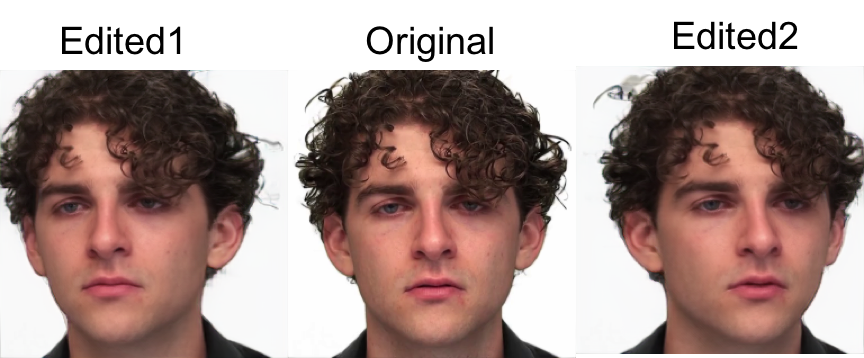
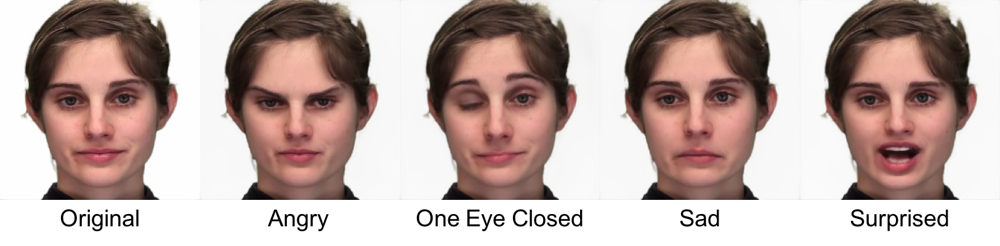

## Face Editor With FOMM(like) Model

This repo contains a facial editor with pretrained FOMM-like models.


### Usage
1. Prepare the environment:
```console
$ conda create env --name face_editor python=3.7
$ conda activate face_editor
$ pip install -r requirements.txt
```

2. Download the pretrained model(here we use [TPSMM](https://github.com/yoyo-nb/Thin-Plate-Spline-Motion-Model) as a demonstration), download ```vox.pth.tar``` and put it under ```pretrained_models```.

3. Start editing:
```console 
$ python main.py --input {path to image}
```

| Key | Description|
|---|---|
|Key_S| Turn off/on display of key points |
|Key_T| Save the current result |
|Key_ESC| Close the window|

4. Here are some results:
    
    Pose edit:
    

    Face shape edit:
    

    Expression edit:
    


